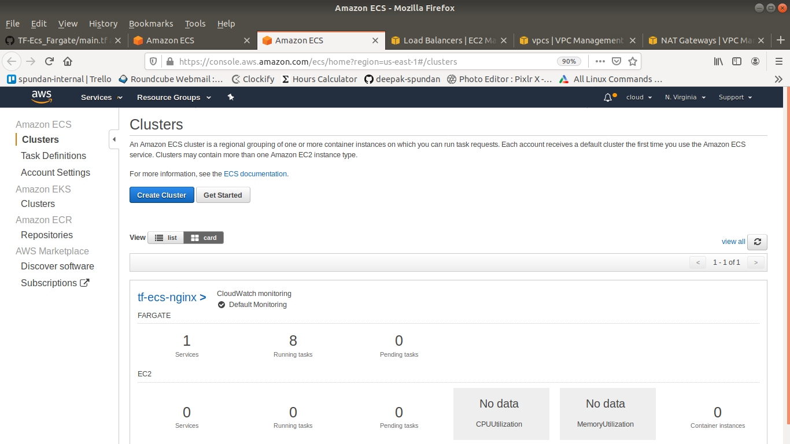
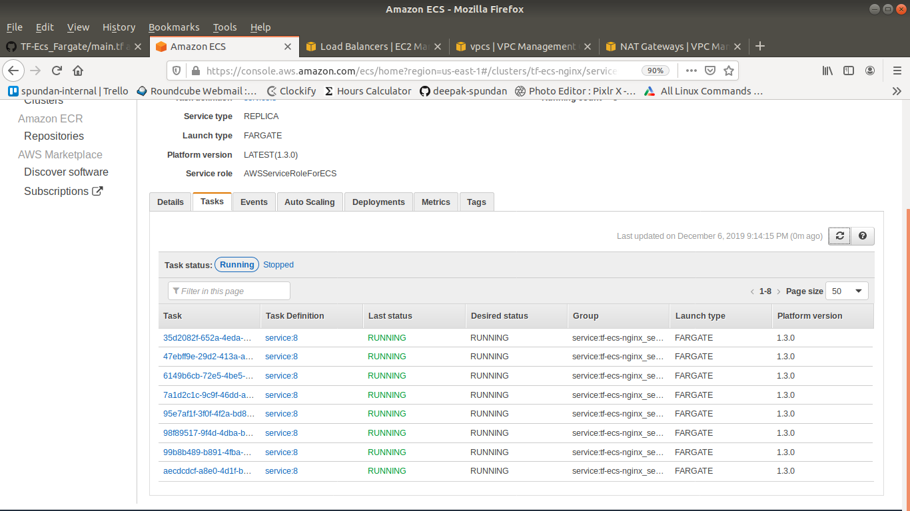
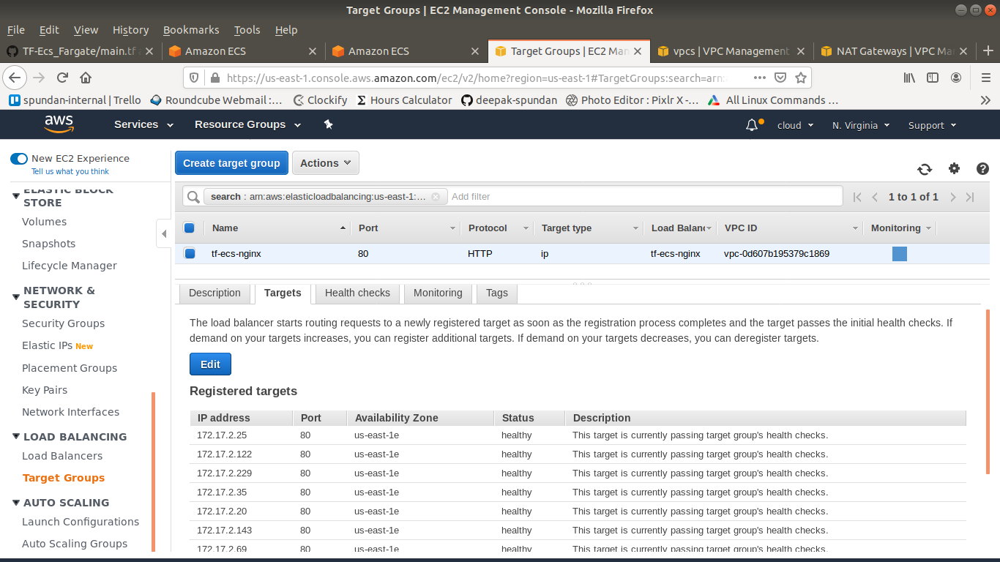
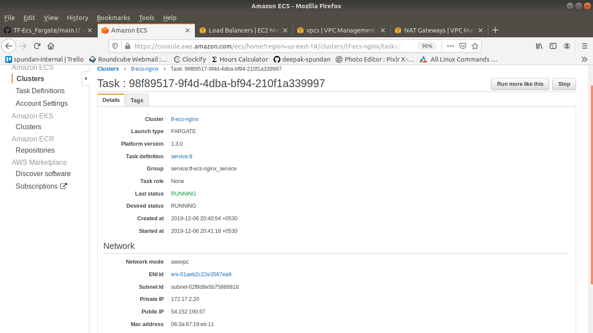
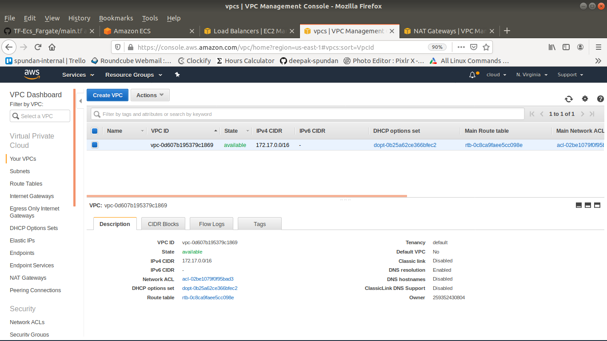

## Demo Time :) :

### ECS-Cluster With Fargate, Automate By Terraform

### This gives the full information about the ECS cluster and count of task. 

### Here we can see about how many task is created & there status & launch type.

### We can check the target group associated with which port.

### It's gives the full details about the particular atsk.

### Here we can see the created vpc's it's state and so on information. 
